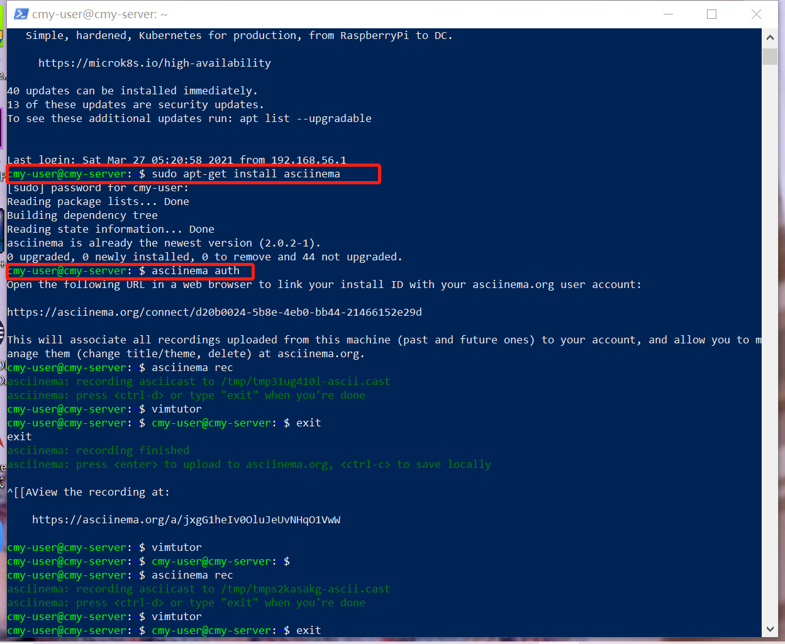

## 第二章实验 学习vimtutor操作并使用asciinema录屏

### 实验目的

学习vimtutor基本操作，熟练使用asciinema录屏

### 实验环境

Ubuntu 20.04

asciinema

### 实验要求

- [x] 根据vimtutor操作手册完成操作并使用asciinema进行录屏
- [x] 完成自查清单

### 实验步骤

#### 1.注册asciinema账号,登录后在本地安装并进行一些配置

```
sudo apt-add-repository ppa:zanchey/asciinema
sudo apt-get update
sudo apt-get install asciinema
asciinema auth
```



#### 2.使用asciinema开始录屏，进入vimtutor学习相应操作，每一至两小节结束一次录制。

```
asciinema rec 
vimtutor 
:q! <ENTER> 
exit 
```

[lesson1.1-1.2 - asciinema](https://asciinema.org/a/402802)

[lesson1.3 - asciinema](https://asciinema.org/a/XBq6xXcXeatgxO7yzvBg3Djsb)

[lesson1.4 - asciinema](https://asciinema.org/a/lvS2uNl4aLYGSNkQWlqMUKgPc)

[lesson1.5 - asciinema](https://asciinema.org/a/9dwbU8egBHNzYnoFSJy8JolQl)

[lesson1.6 - asciinema](https://asciinema.org/a/z5jAsLNmECbywdYCvg09FtSvY)

[lesson2.1 - asciinema](https://asciinema.org/a/auO6zrUtqotJFb48nThcmd3Iu)

[lesson2.2 - asciinema](https://asciinema.org/a/cRJEy7WAcltlbwsFxPoM20qYC)

[lesson2.3-2.4 - asciinema](https://asciinema.org/a/ygAVHuomOBXw3rKc3DlGTH9wN)

[lesson2.5-2.6 - asciinema](https://asciinema.org/a/AGGyoQss8ARxa7WBgmjAR8DvX)

[lesson2.7 - asciinema](https://asciinema.org/a/G14p4z1WjCvaFBKLKCRMmD5ym)

[lesson3.1-3.2 - asciinema](https://asciinema.org/a/csC58Q4PuKAmlvmkiRybKJzbT)

[lesson3.3-3.4 - asciinema](https://asciinema.org/a/7BDcmrFk0rDP16Po8BIP1I3y1)

[lesson4.1-4.2 - asciinema](https://asciinema.org/a/cMVEFGyV2sp7HLa5Dmyy50EZy)

[lesson4.3-4.4 - asciinema](https://asciinema.org/a/Kczm0dDd4trBFvYXUU8gjRrpZ)

[lesson5.1-5.4 - asciinema](https://asciinema.org/a/xe67AlG5jf5VicbI2PvxKdq4z)

[lesson6.1-6.2 - asciinema](https://asciinema.org/a/L9afC5MtAYG1rOXUjbOXgvkXy)

[lesson 6.3-6.5 - asciinema](https://asciinema.org/a/RbWBrgUQBjjR4sgRA0MNyUzBi)

[lesson 7.1 - asciinema](https://asciinema.org/a/hpO5gxjTbVX2bpUR939wyqGNC)

[lesson 7.2-7.3 - asciinema](https://asciinema.org/a/Vqgzi56DFX8Z3WXESnJfPLQ0d)

#### 3.问题自查


1. 你了解vim有哪几种工作模式？

   命令模式，插入模式，底行模式

2. Normal模式下，从当前行开始，一次向下移动光标10行的操作方法？如何快速移动到文件开始行和结束行？如何快速跳转到文件中的第N行？

   ```
   10j
   gg#开始行
   G#结束行
   NG
   ```

   

3. Normal模式下，如何删除单个字符、单个单词、从当前光标位置一直删除到行尾、单行、当前行开始向下数N行？

   ```
   x#字符
   dw#单词
   d$#行尾
   dd#单行
   Ndd#下数N行
   ```

   

4. 如何在vim中快速插入N个空行？如何在vim中快速输入80个-？

   ```
   No #前插
   NO #后插
   80i/a- #80个- 
   ```

   

5. 如何撤销最近一次编辑操作？如何重做最近一次被撤销的操作？

   ```
   u
   CTRL-R
   ```

   

6. vim中如何实现剪切粘贴单个字符？单个单词？单行？如何实现相似的复制粘贴操作呢？

   ```
   v#选中
   $#选中当前行
   d#剪切
   p#粘贴
   
   v#选中
   $#选中当前行
   y#复制
   p#粘贴
   ```

   

7. 为了编辑一段文本你能想到哪几种操作方式（按键序列）？

   ```
   a i o #插入
   d #剪切
   y #复制
   p #粘贴
   r #替换
   x dd dw d$ #删除
   ```

   

8. 查看当前正在编辑的文件名的方法？查看当前光标所在行的行号的方法？

   ```
   :f/:e #文件名
   CTRL-g #行号
   ```

   

9. 在文件中进行关键词搜索你会哪些方法？如何设置忽略大小写的情况下进行匹配搜索？如何将匹配的搜索结果进行高亮显示？如何对匹配到的关键词进行批量替换？

   ```
   /or? #关键词
   ：set ic #忽略大小写
   set hls #显示高亮
   % s/xxx/yyy/g #批量替换
   ```

   

10. 在文件中最近编辑过的位置来回快速跳转的方法？

    ```
    CTRL-O #向前跳转
    CTRL-I #向后跳转
    ```

    

11. 如何把光标定位到各种括号的匹配项？例如：找到(, [, or {对应匹配的),], or }

    ```
    %#光标移到括号下面
    ```

    

12. 在不退出vim的情况下执行一个外部程序的方法？

    ```
    :!<command>
    ```

    

13. 如何使用vim的内置帮助系统来查询一个内置默认快捷键的使用方法？如何在两个不同的分屏窗口中移动光标？

    ```
    :help <shortcut> #默认快捷键
    CTRL-W #移动光标
    ```

    

实验问题：不小心把分支close了，重新提交了一次，在截至日期后了（哭